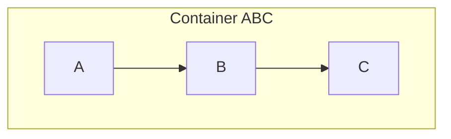
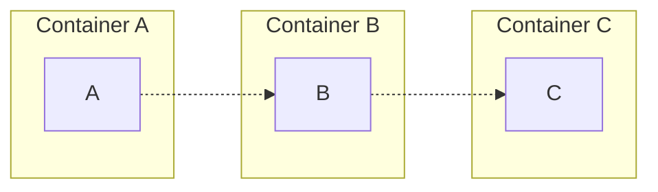

# Bioinformatics Intro

This repository exits to be an introduction to the software tools used in bioinformatics and some example use cases.

Following this book: [Bioinformatics: A Practical Guide to Next Generation Sequencing Data Analysis](https://www.amazon.com/Bioinformatics-Practical-Generation-Sequencing-Computational/dp/103240891X).

Also includes some extra [nextflow] code after watching this [demo](https://youtube.com/playlist?list=PLPZ8WHdZGxmUVZRUfua8CsjuhjZ96t62R&si=M3ZXUmxhkrRbSohe). These [nextflow](https://www.nextflow.io/) scripts take parts of each chapter to create example workflows.

> [!NOTE]
> Some alternatives to nextflox are [snakemake](https://snakemake.readthedocs.io/en/stable/) and [wdl](https://docs.openwdl.org/). These are not currently covered in this repository, but are snakemake and the [miniwdl runtime](https://github.com/chanzuckerberg/miniwdl) are included for your convenience. There is also some cool work for wdl being done at St. Jude in Rust with a [wdl crate](https://crates.io/crates/wdl).

> [!NOTE]
> All dependencies are included except for a few. [ANNOVAR](https://annovar.openbioinformatics.org/en/latest/user-guide/startup/) needs to be installed manually.

> [!WARNING]
> Under construction: some dependencies may move from flox/nix to conda if the nix dependency is too old or vice-versa.

# Usage

I keep the main documentation for the items I'm working on at my personal site. Refer to [this](https://tshanebuckley.github.io/docs/Bioinformatics/requirements) for instructions and the tutorial for using the this repository.

# Advice and Use Cases

Overall, I recommend using this repository to learn by example. I do NOT recommend using this repository for anything beyond learning if you are brand new to most of these concepts. Focus on learning the basics. Maybe make a few tweaks to scripts to see how the outputs change to help enforce what you've learned.

Those more technically savvy may want to steal the flox environment as a base for creating their own containers
for reproducible pipelines. Feel free to fork the repo and use it as you wish. If you want slimmer containers, I would recommend using the `.flox/lib/env/manifest.toml` file as a template. This is where I integrate conda
with flox.

I recommend the latter approach. In a real world use case, it is best to make task-specific containers instead of one container for the workflow, though both cases are valid and you may be
limited by your HPC/production environment.

For example, assuming we have that we have sub-tasks A, B, and C:

- Run as a single task with a single container

> In this case, the workflow runs in one process so the process starts the container.

- Each sub-task run in isolation

> In this case, the workflow runs in separate processes so some workflow manager must handle activating and running the containers.

> [!NOTE]
> If you like those diagrams, check out [mermaid](https://www.mermaidchart.com/).

# Future Work

I hope to use this repository as a record of what I have learned in bioinformatics and to be a quick and easy setup environment to lower the barrier to entry for learning tools specific to the field. My career thus far has been split between running preprocessing pipelines for neuroimaging labs and building chemistry applications. So I may expand this to cover the following topics more in-depth:

- [Slurm](https://slurm.schedmd.com/documentation.html) -> use [this repo](https://github.com/giovtorres/slurm-docker-cluster) to give a quick example on running slurm jobs.
- [fMRIPrep](https://fmriprep.org/en/stable/) and [BIDS](https://bids.neuroimaging.io/).
- self-hosted object storage with [minio](https://min.io/).
- basic statistics.
- bioinformatics algorithms.
- machine learning.
- [Rust](https://www.rust-lang.org/), [wasm](https://webassembly.org/), and [wit](https://component-model.bytecodealliance.org/design/wit.html).
- Apache [arrow](https://arrow.apache.org/) and [parquet files](https://parquet.apache.org/).
- Python, R, and bash scripting.
- Data orchestrators like [dagster](https://dagster.io/) and [airflow](https://airflow.apache.org/).

I also could provide examples for generic software engineering topics (which may be more niche topics for bioinformatics software engineers):

- C#/.NET/Blazor
- SQL and database migrations
- JavaScript/React
- data structures
- design patterns
- architecture patterns (layered and clean)
- ETL and ELT patterns
- domain-driven design
- MVVM vs MVC
