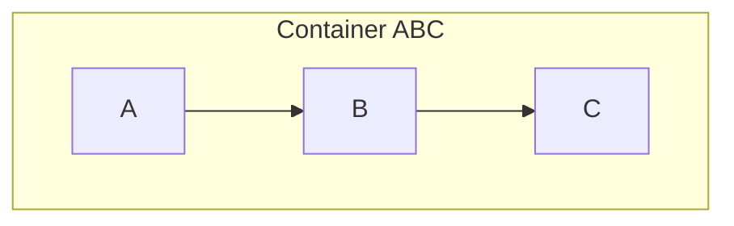
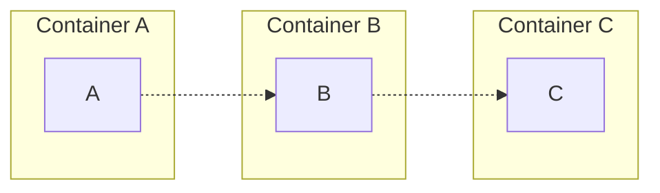

# Bioinformatics Intro

This repository exits to be an introduction to the software tools used in bioinformatics and some example use cases.

Following this book: [Bioinformatics: A Practical Guide to Next Generation Sequencing Data Analysis](https://www.amazon.com/Bioinformatics-Practical-Generation-Sequencing-Computational/dp/103240891X).

Also includes some extra [nextflow] code after watching this [demo](https://youtube.com/playlist?list=PLPZ8WHdZGxmUVZRUfua8CsjuhjZ96t62R&si=M3ZXUmxhkrRbSohe). These [nextflow](https://www.nextflow.io/) scripts take parts of each chapter to create example workflows.

> [!NOTE]
> Some alternatives to nextflox are [snakemake](https://snakemake.readthedocs.io/en/stable/) and [wdl](https://docs.openwdl.org/). These are not currently covered in this repository, but are snakemake and the [miniwdl runtime](https://github.com/chanzuckerberg/miniwdl) are included for your convenience. There is also some cool work for wdl being done at St. Jude in Rust with a [wdl crate](https://crates.io/crates/wdl).

> [!NOTE]
> All dependencies are included except for a few. [ANNOVAR](https://annovar.openbioinformatics.org/en/latest/user-guide/startup/) needs to be installed manually.

> [!WARNING]
> Under construction: some dependencies may move from flox/nix to conda if the nix dependency is too old or vice-versa.

# Usage

## Requirements

You must be on a Unix-based OS (tested with Ubuntu), and have [flox](https://flox.dev/docs/install-flox/) and [git](https://git-scm.com/) installed.

For Windows users: it is recommended to use the Windows Subsystem for Linux, AKA: [WSL](https://learn.microsoft.com/en-us/windows/wsl/install).

For Mac users: If you have a Mac with an Intel processor, this should work as is, but is untested. Otherwise sorry, but looks like you'll need to use a VM or find a Linux or Windows machine.

> [!WARNING]
> Running on Mac is untested and does not include Apptainer because it is unavailable for Darwin.

If you are familiar with [conda](https://docs.conda.io/projects/conda/en/stable/user-guide/index.html), flox is a similar tool. In short, flox is like conda
for Linux environments, supporting more than just Python, R, and traditional scientific utilities.

You should not need to install conda. Flox allows for custom environment configuration through bash scripting. The flox environment will install conda on the first activation.

If you are curious about [docker](https://www.docker.com/), [apptainer](https://apptainer.org/docs/admin/latest/), or [podman](https://podman.io/) containers, these have been included in the flox environment.

## Start the Environment

1. Clone the Repository with git

```bash
# clone
git clone https://github.com/tshanebuckley/ngs_intro.git
# enter the directory
cd ngs_intro
```

2. Start the Environment

```bash
flox activate
```

That's pretty much it, you clone the repo and get going!

## Repository Structure

Under the `.flox` folder, you will find the basic flox environment. As you use this environment and after the initial activation,
you will notice that the `.flox/lib` directory will include a directory with the same name as your user profile. This folder is created and used as your `$HOME` directory to keep this completely isolated from your main system. This makes cleaning this up as simple as deleting the cloned repository and helps avoid overriding or overlapping with your system.

Everything else are examples to try running yourself. Have fun!

## Helper Scripts

- Exporting the conda spec file:

```bash
# file placed in the ngs_intro directory
export_conda_spec
```

- Exporting the conda env yaml file:

```bash
# file placed in the ngs_intro directory
export_conda_env
```

- Exporting the conda spec file and env yaml file:

```bash
# files placed in the ngs_intro directory
export_conda
```

- Deleting the completed chapters (so that someone may attempt them from scratch):

```bash
# TODO
```

> [!NOTE]
> These helper scripts are aliases found in the `profile` section of the `.flox/lib/env/manifest.toml` file.

# Containers

In order to build containers in these environments, you need to install `newuidmap` and `newgidmap` in your actual Linux host environment before entering the flox environment.

This can be done with the following command:

```bash
sudo apt-get install -y uidmap
```

A rootless docker daemon is set to start on startup. If using docker, start flox with the `-s` flag to start our configured services:

```bash
flox activate -s
```

Our examples are meant to be run from the `ngs_intro/containers` directory, so navigate there before running any of the below examples. We will mainly focus on 3 examples for each container platform:

1. Simply running an image from a container registry.
1. Building and running an image locally.
1. Using our local image to run a cli command in our containerized environment.

> [!NOTE]
> Using apptainer should mostly be the same as using [singularity](https://docs.sylabs.io/guides/4.2/user-guide/index.html). Singularity is owned by [Sylabs](https://sylabs.io/singularity/) who provide a community edition of singularity (SingularityCE). Apptainer is a fork of singularity maintained by the [Linux Foundation](https://www.linuxfoundation.org/). This repository focuses on apptainer, but the basics still apply to singularity.

Below, we will cover some basics of each container runtime. We will highlight running, building, and some of the differences between each tool.

## Docker

Docker is the original container runtime. It typically requires a daemon process to be running to function normally, which can make local development difficult. Docker is also not recommended to be installed on local machines in production user environments as it exposes the security concern of elevating to root privileges.

### Running a Docker Image

For a simple example of running a docker container image, run this command:

```bash
docker run --rm grycap/cowsay
```

### Building and Running a Docker Image

The `Dockerfile` is the document that describes how the container will be built. We build can build and run it with the following commands:

```bash
# build the container image
docker build -t hello-py .
# check that we have the container image locally
# under REPOSITORY there should be an image named "hello-py"
docker images
# start a container using the hello-py image
docker run -d -v ./messages:/app/messages -p 8080:80 hello-py
# get information on your running containers
docker ps
```

You should be able to navigate to this url to see the app running: `http://localhost:8080/` where you will see a simple `Hello, World!` message.

> [!TIP]
> The `-d` flag for the `docker run` command runs the container as a daemon process. Many workflows will simply run the container as it does not need to be launched as a service.

> [!TIP]
> The `-v` flag for the `docker run` command mounts our `./messages` directory in the container's `/app/messages` directory. This allows us to access files on our computer from our container.

> [!TIP]
> The `-p` flag for the `docker run` command forwards the container's `port 80` to our computer's `port 8080`. This allows us to communicate to the app running in our container from our computer.

If you navigate to the following endpoints you will see the following messages:

- `http://localhost:8080/messages` -> `No messages are available.`
- `http://localhost:8080/messages/cat` -> `No message found for "cat".`

Our simple [Flask]() application is built to serve files from the `/app/messages` directory as responses. Our container has this directory mounted to our repository's `ngs_intro/containers/messages` directory. If we add files ending in `.txt` to this folder, then our responses will change when we refresh these pages. Run `./messages.sh` to generate some examples. Our endpoints will now return the following:

- `http://localhost:8080/messages` -> `dog cow cat`
- `http://localhost:8080/messages/dog` -> `Woof!`
- `http://localhost:8080/messages/cow` -> `Moo!`
- `http://localhost:8080/messages/cat` -> `Meow!`

You can give it a try yourself and add your own text file.

You can stop the container by running `docker stop <CONTAINER ID>`, where you can get the `CONTAINER ID` from the original response from running `docker run` or from running `docker ps`.

> [!WARNING] It's recommended to stop this docker container before moving on to any other examples.

### Using our Docker Image to run a Script

```bash
# build the container image
# (only if you did not build the image in the previous example)
docker build -t hello-py .
# run the script
docker run -v ./messages:/app/messages hello-py:latest python cli.py message cat
```

Like the service example above, our cli has the following commands:

- `hello` -> prints a `Hello, World!` message
- `messages` -> prints our available messages
- `message <msg>` -> prints the message for cat/dog/etc if available.

### Overview

Our main take aways are the following:

- Containers may be used to launch a service, but for bioinformatics, we will mainly use them to reproducibly run cli commands in pipelines
- If we want files available in our container, we must mount them when starting/running the container.
- Same as mounting, we must forward ports to our local machine if we wish to do any networking.
- Container images can live in registries and be pulled to my computer to run.
- I can build container images on my computer using a Dockerfile (sometimes called a Containerfile).
- A "container image" is the definition of a container to be run, but and a "container instance" is a specific instance of a running container.

> [!NOTE] And most importantly, containers allow us to create re-usable environments to have better and more reproducible science.

## Podman

Working with podman should feel like working with docker. It is a docker-compatible, but runs daemonless and natively runs in a rootless manner. It is designed to be more secure than running docker containers.

> [!NOTE]
> Currently, running podman in this flox environment produces the following warning:
>
> `WARN[0000] Using cgroups-v1 which is deprecated in favor of cgroups-v2 with Podman v5 and will be removed in a future version. Set environment variable 'PODMAN_IGNORE_CGROUPSV1_WARNING' to hide this warning.`

### Running a Podman Image

For a simple example of running a docker container image, run this command:

```bash
podman run --rm docker://grycap/cowsay
```

### Building and Running a Podman Image as a Service and Script

This is the exact same as the docker example above, just replace the term `docker` with `podman`.

## Apptainer

Apptainer is a container platform designed to be executed on HPC environments. Apptainer is like podman in that it is designed to be run with limited privileges. It is also benefits from extra portability as apptainer containers are created as individual `.sif` files.

> [!NOTE]
> Apptainer currently throws the following error when running containers:
>
> `ERROR: ld.so: object '/nix/store/kas9zlj7iyac7bli0agr8yqjvrqg2iqg-ld-floxlib-1.0.0/lib/ld-floxlib.so' cannot be loaded as audit interface: cannot open shared object file; ignored.`
>
> I believe this is from [ld-floxlib](https://github.com/flox/ld-floxlib) being archived/deprecated and should not cause issue.

### Running an Apptainer Image

```bash
apptainer run docker://grycap/cowsay
```

### Building and Running an Apptainer Image

In this example, `lolcow.def` is the equivalent to a `Dockerfile`; however, for apptainer, the build specification may be explicitly given as input to the `build` command.

```bash
# build the container
apptainer build lolcow.sif lolcow.def
# run the container
apptainer run lolcow.sif
```

### Building and Running an Apptainer Image from a Docker Image

You can also build an apptainer image from a remote or local docker image.

Remote (aka, from [Docker Hub](https://hub.docker.com/)):

```bash
# build the container
apptainer build lolcow_remote_docker.sif docker://grycap/cowsay
# run the container
apptainer run lolcow_remote_docker.sif
```

Local (aka, from the images managed by the local docker daemon):

> [!NOTE]
> We are using our `Dockerfile` to run the same application in apptainer as we ran with docker and podman.

```bash
# build the docker container
# (you can skip this step if you already built this container in the docker example)
docker build -t hello-py .
# build the apptainer container
apptainer build hello.sif docker-daemon://hello-py:latest
# run the container
apptainer exec --cwd /app -B ./messages:/app/messages hello.sif python cli.py messages
```

> [!TIP]
> The `-B` argument is the equivalent to docker's `-v` argument to mount volumes.

> [!TIP]
> The `--cwd` argument is required when using the `exec` command as apptainer will default the current working directory to the directory from where apptainer is invoked.

### Building and Running a Apptainer Image as a Service

> [!WARNING]
> Running the below task will NOT work with the nix environment we have created, but is included for completeness. This is because the nix install does NOT permit the user the behavior to launch network tasks or to operate as a fakeroot. If you happen to work in an environment where this is enabled, this could be useful to you.

```bash
# build the docker container
# (you can skip this step if you already built this container in the docker example)
docker build -t hello-py .
# build the apptainer container
apptainer build hello.sif docker-daemon://hello-py:latest
# run the container
apptainer instance start -f -B ./messages:/app/messages -n --network-args "portmap=8080:80/tcp" hello.sif hello-py1
# get information on your running containers
apptainer instance list
```

You can stop this container with the `apptainer instance stop hello-py1` command.

# Virtual Environments/Package Managers

**Package Manager**: a software tool that automates the process of installing, updating, configuring, and removing computer programs on a system.

**Virtual Environment**: a computer-generated space that allows users to interact with a simulated environment.

With the goal of reproducibility, package managers exist to lower the burden of finding and installing software dependencies. [Nix](https://nixos.org/) is one of the largest examples of a package manager, though language specific ones also exits like Python's [PyPI](https://pypi.org/), R's [CRAN](https://cran.r-project.org/), and Rust's [crates](https://crates.io/).

While package managers simplify adding, removing, and updating packages, many of them also assist in revolving package version conflicts. These dependency conflicts may lead to a desire to have multiple environments designed for executing certain tasks or running certain software. Therefore, virtualizing environments allows us to have multiple different environments available on the same machine. These environments typically track themselves as a schema/config/manifest file of dependencies installed from a package managers. This also adds to the reproducibility aspect of virtual environments.

In many cases, these virtual environments may be shared by their manifest and re-used. A common use case is also to uses these package managers and virtual environments to create containers as it reduces the amount of code that must be used to install the dependencies in the container definition (typically a Dockerfile).

We will focus on creating virtual environments using:

- [conda](https://docs.conda.io/projects/conda/en/stable/user-guide/index.html) for its widespread adoption among the data science and scientific communities.
- [flox](https://flox.dev/docs/install-flox/) a newer, but powerful virtual environment tool powered by Nix.

We will focus on these basics across these virtual environment platforms:

- install the package manager
- creating a new environment
- activating an environment
- finding packages to install
- installing a package
- uninstalling a package
- exporting the environment
- importing the environment

> [!NOTE]
> We provide `ngs_intro/venvs/conda` and `ngs_intro/venvs/flox` for you to learn the basics without polluting your user environment. If you have installed flox and activated the environment provided with this repository, you can skip installing flox or conda in the below examples.

## Conda

We recommend you `cd ./ngs_intro/venvs/conda` to run the following commands in a clean environment that will not be persisted in git.

### Install Conda

Follow the installation instructions [here](https://docs.anaconda.com/miniconda/install/) for your operating system.

### Creating a new Conda Environment

Create a new env named `test`:

```bash
conda create --name test
```

### Activating a Conda Environment

We can activate our `test` environment with the following command:

```bash
# create the environment
conda activate test
# list the environments to see our new 'test' env
conda env list
```

### Searching for packages with Conda

The conda cli has a search method, but I would recommend searching for packages [here](https://anaconda.org/).

### Installing a Conda Package

We will install the `cowpy` conda package and run it from the cli:

```bash
# install 'cowpy'
conda install cowpy
# run the command to say hello world
cowpy -r "Hello, World!"
```

### Exporting a Conda Environment

```bash
conda env export --from-history > environment.yml
```

### Deactivating the Conda Environment

```bash
conda deactivate
```

### Deleting a Conda Environment

```bash
# remove the 'test' environment
conda env remove -n test
# list the environments to see our 'test' env no longer exists
conda env list
```

### Importing a Conda Environment

```bash
# this will re-create out 'test' environment from the yaml file
conda env create -f environment.yml
# list the environments to see our re-created 'test' env
conda env list
```

### Uninstalling a Conda Package

```bash
# re-activate our re-created 'test' env
conda activate test
# view our listed dependencies
conda list
# uninstall 'cowpy'
conda uninstall cowpy
# see that our packages have been uninstalled
# view our listed dependencies
conda list
```

---

At this point, our small conda tutorial is complete and we have:

1. Created a conda environment named 'test'
1. Installed the 'cowpy' package
1. Saved the environment state in an 'environment.yml' file.
1. Deleted the environment.
1. Re-createad the environment from the 'environment.yml' file.
1. Uninstalled the 'cowpy' package,

From here you can deactivate the test environment and move on to another section of this repository.

## Flox

We recommend you `cd ./ngs_intro/venvs/flox` to run the following commands in a clean environment that will not be persisted in git.

### Install Flox

Follow the installation instructions [here](https://flox.dev/docs/install-flox/) for your operating system.

If you are currently in a flox environment, it is recommended you exit this environment and navigate the the directory mentioned above before continuing.

```bash
# to exit a flox env
exit
```

### Creating a new Flox Environment

```bash
flox init
```

### Activating a Flox Environment

```bash
flox activate
```

### Searching for a Nix Package with Flox

```bash
flox search cowsay
```

### Installing a Flox Package

```bash
# install 'cowsay'
flox i cowsay
# run it to show that it is working
cowsay "Hello, World!"
```

You will probably get some perl warnings when running cowsay. To fix this, open the `./.flox/env/manifest.toml` file and add the following `vars` section:

> [!TIP] You can make this edit through your terminal's default editor with `flox edit`, which will add the benefit of validating your flox config after editing.

```diff
...
# Set environment variables in the `[vars]` section. These variables may not
# reference one another, and are added to the environment without first
# expanding them. They are available for use in the `[profile]` and `[hook]`
# scripts.
[vars]
# message = "Howdy"
+ LC_ALL = "C"
...
```

Now, if you exit and re-activate the environment, these warnings should go away.

```bash
# deactivate
exit
# re-activate
flox activate
# run 'cowsay'
cowsay "Hello, World!"
```

### Exporting a Flox Environment

Unlike with conda, where we export and import from a yaml file, flox expects the entire `.flox` folder to be copied. The flox environment is presumed to normally be [shared as git repositories or container](https://flox.dev/docs/tutorials/sharing-environments/), but we will do an example on our local file system for a simple demonstration.

```bash
# make a new directory for the copied env to live
mkdir copy
# make a new '.flox' dir
mkdir copy/.flox
# copy the env over
cp -r .flox/* ./copy/.flox
# exit your current flox env
exit
# enter your copied flox directory
cd copy
flox activate
# run 'cowsay' to show that this new env works
cowsay "Hello, World!"
```

You now have flox environment under `ngs_intro/venvs/flox/copy` that is a copy of the environment located under `ngs_intro/venvs/flox`.

### Uninstalling a Flox Package

```bash
# uninstall 'cowsay'
flox remove cowsay
# attempt to run 'cowsay' to show it is uninstalled
cowsay "Hello, World!"
```

### Deleting a Flox Environment

```bash
# exit the environment
exit
# delete the environment
flox delete
# note the the '.flox' folder is gone
ls -a
```

> [!NOTE] You could also just manually delete the `.flox` folder.

## Flox and Conda together

Flox and conda can both be installed for Linux and Mac. If you look into the `ngs_intro/.flox/env/manifest.toml` under the `[hook].on-activate` section, you will find a bash script that integrates using conda within a flox environment. This gives us the power to create reusable environments that leverage both tools.

# Advice and Use Cases

Overall, I recommend using this repository to learn by example. I do NOT recommend using this repository for anything beyond learning if you are brand new to most of these concepts. Focus on learning the basics. Maybe make a few tweaks to scripts to see how the outputs change to help enforce what you've learned.

Those more technically savvy may want to steal the flox environment as a base for creating their own containers
for reproducible pipelines. Feel free to fork the repo and use it as you wish. If you want slimmer containers, I would recommend using the `.flox/lib/env/manifest.toml` file as a template. This is where I integrate conda
with flox.

I recommend the latter approach. In a real world use case, it is best to make task-specific containers instead of one container for the workflow, though both cases are valid and you may be
limited by your HPC/production environment.

For example, assuming we have that we have sub-tasks A, B, and C:

- Run as a single task with a single container

> In this case, the workflow runs in one process so the process starts the container.



- Each sub-task run in isolation

> In this case, the workflow runs in separate processes so some workflow manager must handle activating and running the containers.



> [!NOTE]
> If you like those diagrams, check out [mermaid](https://www.mermaidchart.com/).

# Future Work

I hope to use this repository as a record of what I have learned in bioinformatics and to be a quick and easy setup environment to lower the barrier to entry for learning tools specific to the field. My career thus far has been split between running preprocessing pipelines for neuroimaging labs and building chemistry applications. So I may expand this to cover the following topics more in-depth:

- [Slurm](https://slurm.schedmd.com/documentation.html) -> use [this repo](https://github.com/giovtorres/slurm-docker-cluster) to give a quick example on running slurm jobs.
- [fMRIPrep](https://fmriprep.org/en/stable/) and [BIDS](https://bids.neuroimaging.io/).
- self-hosted object storage with [minio](https://min.io/).
- basic statistics.
- bioinformatics algorithms.
- machine learning.
- [Rust](https://www.rust-lang.org/), [wasm](https://webassembly.org/), and [wit](https://component-model.bytecodealliance.org/design/wit.html).
- Apache [arrow](https://arrow.apache.org/) and [parquet files](https://parquet.apache.org/).
- Python, R, and bash scripting.
- Data orchestrators like [dagster](https://dagster.io/) and [airflow](https://airflow.apache.org/).

I also could provide examples for generic software engineering topics (which may be more niche topics for bioinformatics software engineers):

- C#/.NET/Blazor
- SQL and database migrations
- JavaScript/React
- data structures
- design patterns
- architecture patterns (layered and clean)
- ETL and ELT patterns
- domain-driven design
- MVVM vs MVC
